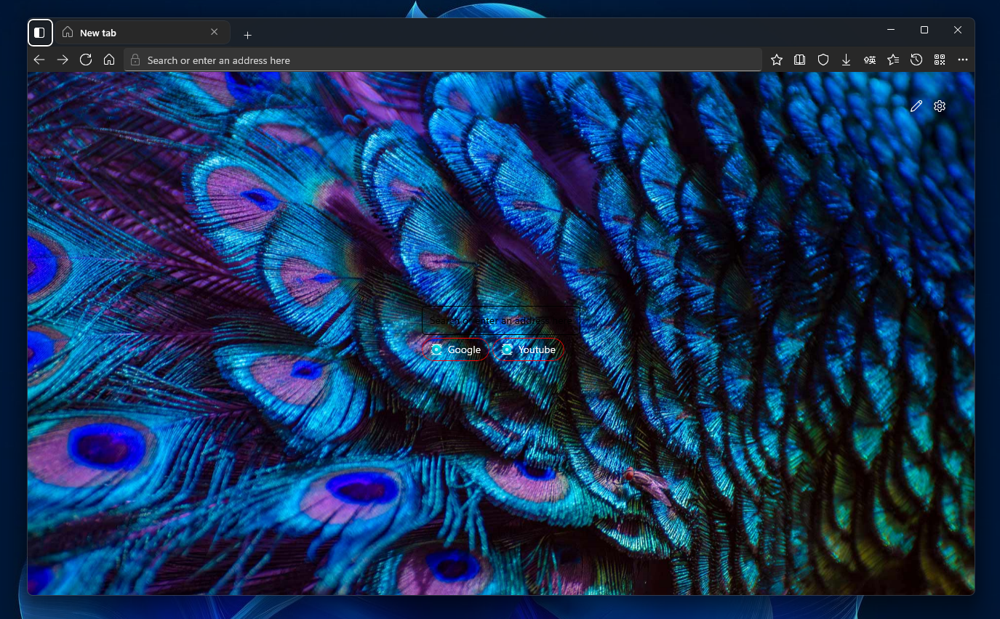
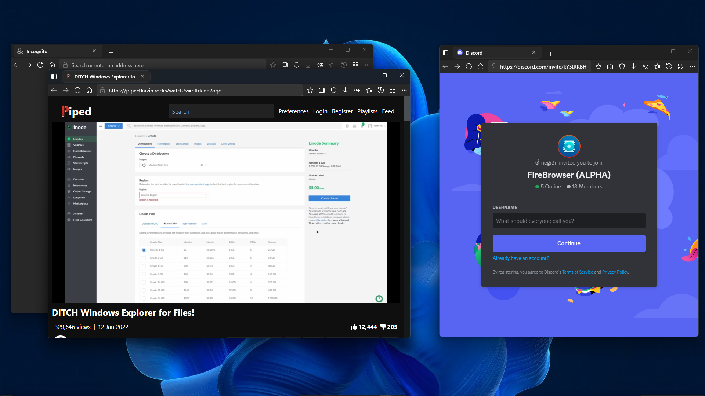

  
  <h1>FireBrowser</h1>

### A modern Web browser with a beautiful UI built with the UWP/WinUI3 and the WebView2 SDK.

# Features:
- Blazingly fast
- Low ram usage
- Browse the web
- Search suggestions
- Reading mode
- QR Code generator
- Pinned sites
- Focus mode
- Note on websites
- Compact overlay
- Split browsing
- Freeform

# NOTE:
when compiling this on windows 10 make sure you have the latest install of windows SDK so you dont encounter any issues when building te project, also change the target framework to version 2004 if your on windows 10.

# Screenshots

   
   
   
   

TBD

# License
GPL v3.0
